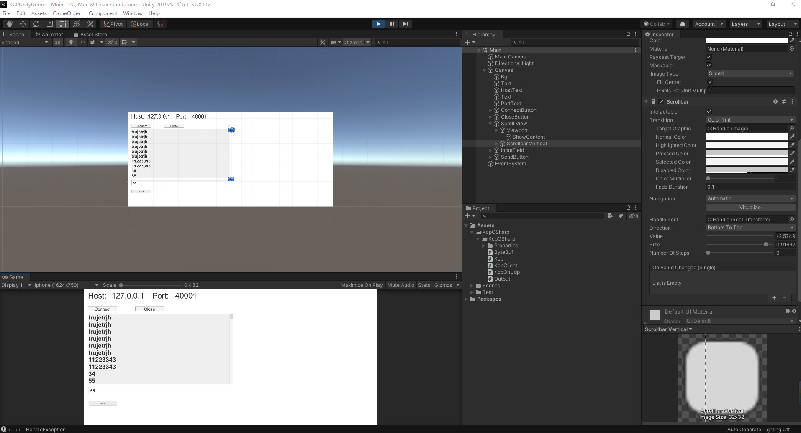
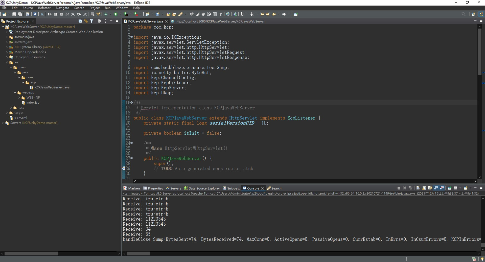

# KCPUnityDemo
KCP网络Unity + Java后台测试Demo

KCP是一个快速可靠协议，能以比 TCP浪费10%-20%的带宽的代价，换取平均延迟降低 30%-40%，且最大延迟降低三倍的传输效果。纯算法实现，并不负责底层协议（如UDP）的收发，需要使用者自己定义下层数据的发送方式，以 callback的方式提供给 KCP。连时钟都需要外部传递进来，内部不会有任何一次系统调用。
TCP是为流量设计的（每秒内可以传输多少KB的数据），讲究的是充分利用带宽。而 KCP是为流速设计的（单个数据从一端发送到一端需要多少时间），以10%-20%带宽浪费的代价换取了比 TCP快30%-40%的传输速度。

## 预览

## 环境

1. Unity 2019.4.14
2. Eclipse 2021-09 (4.21.0)
3. Tomcat apache-tomcat-8.0.52

## 运行

1. git clone https://github.com/TastSong/KCPUnityDemo.git
2. 使用Eclipse打开 **KCPUnityDemo/KCPJavaWebServer** 的JavaWeb项目
3. 右键项目，**Maven -> Update Project** 
4. 右键KCPJavaWebServer.jave，Run As -> Run On Server
5. 第一次运行，会提醒添加**Tomcat**，添加本地Tomcat即可
6. Server运行成功，使用Unity打开**KCPUnityDemo->KCPUnityDemo**
7. 点击运行Unity，点击**Connect**按钮，即可发送消息
8. 一段时间不发送消息，KCP就会**自动断连**，需要重新点击**Connect**按钮，进行重连

## 原理

KCP协议解析 ： [在网络中狂奔：KCP协议 - 知乎 (zhihu.com)](https://zhuanlan.zhihu.com/p/112442341)